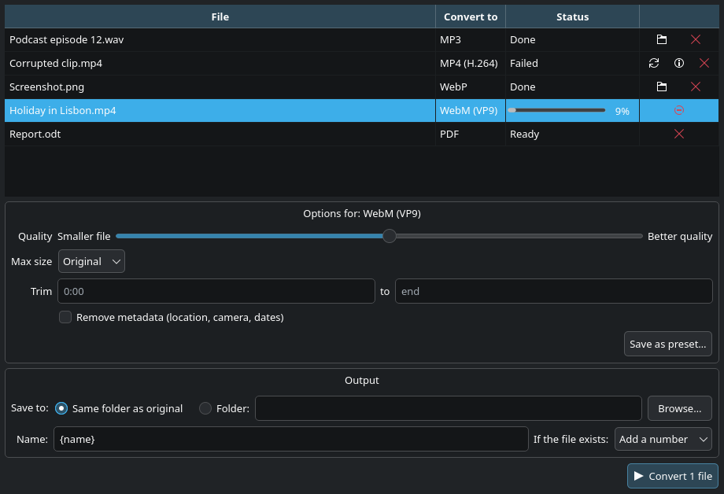

# dolphin-file-converter

[](https://github.com/RichardLitt/standard-readme)
[](LICENSE)

Convert audio, video, images and documents from Dolphin's right-click menu or a drag-and-drop window.

The app is called File Converter on your desktop. Right-click files in Dolphin and pick
**Convert to → MP3**, or **Convert…** to open the window, where you can queue files, pick a format per file, adjust quality, and save your
own presets. Your presets show up in the right-click menu too. Under the hood it runs
ffmpeg, ImageMagick and LibreOffice, so it converts whatever those tools can read.



## Table of Contents

- [Background](#background)
- [Install](#install)
  - [Dependencies](#dependencies)
- [Usage](#usage)
  - [Missing tools](#missing-tools)
  - [Formats](#formats)
  - [CLI](#cli)
- [Maintainers](#maintainers)
- [Contributing](#contributing)
- [License](#license)

## Background

[FileConverter](https://github.com/Tichau/FileConverter) is a popular Windows tool that
adds a "convert to" entry to Explorer's context menu. This project brings the same idea to
KDE Plasma, built with Qt so it looks and behaves like the rest of the desktop.

Converted files are written next to the original (or a folder you choose) and an existing
file is never overwritten unless you ask for that. Each conversion runs in a hidden
temporary folder and only moves into place once it has finished, so a cancelled or failed
conversion never leaves half-written files behind. The optional "move originals to the
Trash" setting only ever moves files to the Trash, and only after a successful conversion.

## Install

Install the [dependencies](#dependencies), then:

```sh
git clone https://github.com/agopalareddy/dolphin-file-converter.git
cd dolphin-file-converter
./install.sh
```

`install.sh` installs for your user only. It puts the `fileconverter` and `fileconvert`
commands in `~/.local/bin`, adds File Converter to the application launcher, and adds the
right-click menus to Dolphin. It runs the app from the cloned folder, so keep that folder
where it is. To remove everything it installed:

```sh
./install.sh --uninstall
```

An AUR package for Arch Linux is being prepared in [`packaging/aur`](packaging/aur/PKGBUILD).

### Dependencies

KDE Plasma 6 with Dolphin, Python 3.11 or newer, and PySide6. The conversion tools are
optional: formats whose tool is missing are greyed out in the app.

| Package | Used for | Arch | Debian / Ubuntu | Fedora |
|---|---|---|---|---|
| PySide6 | the app | `pyside6` | `python3-pyside6.qtwidgets` `python3-pyside6.qtnetwork` `python3-pyside6.qtdbus` | `python3-pyside6` |
| ffmpeg | audio, video | `ffmpeg` | `ffmpeg` | `ffmpeg` (RPM Fusion) |
| ImageMagick 7 | images, PDF pages | `imagemagick` | see note | `ImageMagick` |
| Ghostscript | PDF pages | `ghostscript` | `ghostscript` | `ghostscript` |
| LibreOffice | documents | `libreoffice-fresh` | `libreoffice` | `libreoffice` |
| libnotify | "finished" notification | `libnotify` | `libnotify-bin` | `libnotify` |

Image conversion needs ImageMagick 7, which provides the `magick` command. Debian and
Ubuntu still ship ImageMagick 6, so image and PDF-page formats stay disabled there unless
you install ImageMagick 7 another way.

## Usage

Right-click one or more files in Dolphin:

- **Convert to → _format_** converts straight away and shows the progress in the window.
- **Convert…** opens the window with the files added, so you can choose formats and
  options first.

You can also open File Converter from the application launcher and drag files or whole
folders into it. Converting more files while it is open adds them to the same window.

In the window:

- **Convert to** sets the format for a row; select several rows to change them together.
- **Options** shows the settings that apply to the selected format: quality, maximum video
  size, trim start and end, image resize, removing metadata, and PDF resolution.
- **Save as preset…** stores the current format and options under a name. Saved presets
  appear in every format list and in Dolphin's right-click menu.
- **Output** chooses the folder, the file name pattern (`{name}`, `{preset}`, `{date}`)
  and what to do when a file with that name already exists.
- **Settings** sets how many files convert at once, turns on moving originals to the
  Trash, and manages presets, including which ones appear in the right-click menu.

### Missing tools

If a conversion tool isn't installed, a bar at the top of the window says which one.
**Install…** shows the command for your distribution (Arch-based, Debian/Ubuntu or
Fedora) with a **Copy** button, and **Install in terminal** opens a terminal that runs it;
you confirm with your password there. File Converter never installs anything by itself.
The new formats become available as soon as the install finishes.

### Formats

| Right-click on | Convert to |
|---|---|
| Audio | MP3, AAC (M4A), OGG Vorbis, Opus, FLAC, WAV |
| Video | MP4 (H.264), MP4 (smaller file), WebM (VP9), MKV (no re-encode), animated GIF, and audio only as MP3, AAC, OGG Vorbis, Opus, FLAC or WAV |
| Images | PNG, JPG, WebP, AVIF, GIF, ICO, PDF |
| Documents (DOC, DOCX, ODT, RTF) | PDF, DOCX, ODT |
| Spreadsheets (XLS, XLSX, ODS, CSV) | PDF, XLSX, ODS, CSV (first sheet) |
| Presentations (PPT, PPTX, ODP) | PDF, PPTX, ODP |
| PDF | PNG or JPG, one image per page |

### CLI

`fileconvert` converts without opening a window, using the same presets, including your
own:

```sh
fileconvert video:webm clip.mp4 other.mov
fileconvert user:whatsapp-video holiday.mp4
```

Run `fileconvert` with no arguments to list every preset id. It uses the output folder,
name pattern and clash rule saved by the app, and exits with status 1 if any file failed.

`fileconverter [--preset ID] [FILE...]` opens the window, optionally with files queued and
already converting.

## Maintainers

[@agopalareddy](https://github.com/agopalareddy)

## Contributing

Questions and bug reports are welcome in [GitHub issues](https://github.com/agopalareddy/dolphin-file-converter/issues).
For a failed conversion, include the text from the **?** button next to the file.

Pull requests are welcome. Please run the tests first; they need ffmpeg, ImageMagick,
Ghostscript, LibreOffice and pytest-qt installed, and skip the parts whose tool is missing:

```sh
QT_QPA_PLATFORM=offscreen python -m pytest
```

## License

[MIT](LICENSE) © Aadarsha Gopala Reddy
